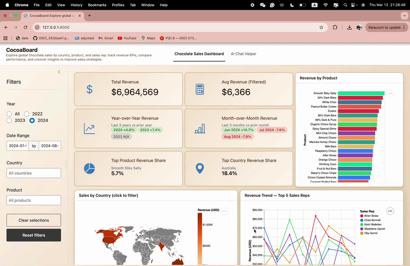

# CocoaBoard

A dashboard for exploring chocolate sales data by sales person, country, product, and time.

## Demo



## What This Dashboard Does

CocoaBoard helps sales managers and regional directors answer key questions at a glance:
- Which countries are generating the most revenue?
- Which sales reps are top performers?
- How do sales vary across products and date ranges?

## Deployed App

- **Stable (main):** [https://vin-dictive-dsci-532-2026-8-cocoaboard-main.share.connect.posit.cloud](https://vin-dictive-dsci-532-2026-8-cocoaboard-main.share.connect.posit.cloud)
- **Development preview:** [https://vin-dictive-dsci-532-2026-8-cocoaboard-development.share.connect.posit.cloud](https://vin-dictive-dsci-532-2026-8-cocoaboard-development.share.connect.posit.cloud)

## Dataset

The dashboard uses the **Chocolate Sales** dataset from Kaggle:

- **Source:** [Chocolate Sales | Kaggle](https://www.kaggle.com/datasets/saidaminsaidaxmadov/chocolate-sales)

## Setup

1. **Clone the repository** (if you haven’t already):

   ```bash
   git clone https://github.com/UBC-MDS/DSCI-532_2026_8_cocoaboard
   cd DSCI-532_2026_8_cocoaboard
   ```

2. **Create and activate the conda environment:**

   ```bash
   conda env create -f environment.yml
   conda activate cocoaboard
   ```

   
3. **Optional — AI Chat tab:** To use the AI chat tab, set your Anthropic API key. Create a `.env` file in the project root (see `.env.example`) and add:

   ```
   ANTHROPIC_API_KEY=your_key_here
   ```

   Get a key at [Anthropic Console](https://console.anthropic.com/). Without it, the Dashboard tab works normally; the AI Chat tab will show an error when you send a message.

4. **Run the dashboard:**

   ```bash
   shiny run src/app.py
   ```

   Then open the URL shown in the terminal (typically `http://127.0.0.1:8000/`) in your browser.

   For development with auto-reload on file changes:

   ```bash
   shiny run src/app.py --reload
   ```

## Running Tests

First-time setup (install browser for Playwright):

```bash
playwright install chromium
```

Then run all tests with:

```bash
pytest
```

The Playwright tests start the Shiny app automatically — no need to run it manually.

### What the tests cover

| Test | File | What it verifies | What breaks if it fails |
|------|------|-----------------|------------------------|
| `test_leaderboard_empty_returns_correct_schema` | unit | Empty DataFrame returns correct column headers | DataGrid component would crash on schema mismatch |
| `test_leaderboard_ranks_by_revenue_descending` | unit | Reps are sorted by revenue descending, rank 1 = highest earner | Sort bug would silently flip the leaderboard |
| `test_leaderboard_summary_row_shows_totals` | unit | Last row is "AVERAGE / TOTAL" with correct revenue and 100% share | Missing footer row would break leaderboard display |
| `test_leaderboard_rev_shares_sum_to_100` | unit | Individual rev shares add up to 100% | Division/rounding error would cause inconsistent totals |
| `test_inject_click_handler_inserts_js_block` | unit | postMessage JS is injected before the Vega IIFE | Map clicks would not propagate country names to Shiny |
| `test_inject_click_handler_preserves_iife_marker` | unit | IIFE marker stays in output after injection | Vega chart would fail to render |
| `test_inject_click_handler_noop_on_missing_marker` | unit | HTML without the marker is unchanged | Arbitrary HTML could be corrupted |
| `test_compute_yoy_revenue_*` (3 tests) | unit | YoY returns correct % or N/A for empty/single-year data | Wrong formula or divide-by-zero in the KPI box |
| `test_compute_mom_revenue_*` (3 tests) | unit | MoM returns correct % or N/A for empty/single-month data | Wrong indexing or divide-by-zero in the KPI box |
| `test_dashboard_renders_all_sections` | playwright | All main UI sections visible on load | A component mount failure goes undetected |
| `test_total_revenue_kpi_displays_dollar_amount` | playwright | Revenue KPI shows a `$`-formatted value | Broken reactive pipeline would leave the field blank |
| `test_country_filter_keeps_leaderboard_visible` | playwright | Applying a country filter doesn't crash the leaderboard | Broken filter reactive would clear the output |
| `test_out_of_range_date_shows_no_data_message` | playwright | Future date range shows "No data to display." | Missing empty-state guard would raise an unhandled exception |

## Contributors

- [Daisy Zhou](https://github.com/daisyzhou-ubc)
- [Vinay Valson](https://github.com/Vin-dictive)
- [Eduardo Rivera](https://github.com/e-riveras)

## Contributing

See [CONTRIBUTING.md](CONTRIBUTING.md) for how to set up your environment and submit changes.

## License

See [LICENSE.md](LICENSE.md).
