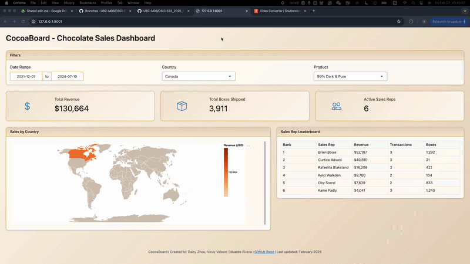

# CocoaBoard

A dashboard for exploring chocolate sales data by sales person, country, product, and time.

## Demo



## What This Dashboard Does

CocoaBoard helps sales managers and regional directors answer key questions at a glance:
- Which countries are generating the most revenue?
- Which sales reps are top performers?
- How do sales vary across products and date ranges?

## Deployed App

- **Stable (main):** [https://vin-dictive-dsci-532-2026-8-cocoaboard-main.share.connect.posit.cloud](https://vin-dictive-dsci-532-2026-8-cocoaboard-main.share.connect.posit.cloud)
- **Development preview:** [https://vin-dictive-dsci-532-2026-8-cocoaboard-development.share.connect.posit.cloud](https://vin-dictive-dsci-532-2026-8-cocoaboard-development.share.connect.posit.cloud)

## Dataset

The dashboard uses the **Chocolate Sales** dataset from Kaggle:

- **Source:** [Chocolate Sales | Kaggle](https://www.kaggle.com/datasets/saidaminsaidaxmadov/chocolate-sales)

## Setup

1. **Clone the repository** (if you haven’t already):

   ```bash
   git clone https://github.com/UBC-MDS/DSCI-532_2026_8_cocoaboard
   cd DSCI-532_2026_8_cocoaboard
   ```

2. **Create and activate the conda environment:**

   ```bash
   conda env create -f environment.yml
   conda activate cocoaboard
   ```

   
3. **Optional — AI Chat tab:** To use the AI chat tab, set your Anthropic API key. Create a `.env` file in the project root (see `.env.example`) and add:

   ```
   ANTHROPIC_API_KEY=your_key_here
   ```

   Get a key at [Anthropic Console](https://console.anthropic.com/). Without it, the Dashboard tab works normally; the AI Chat tab will show an error when you send a message.

4. **Run the dashboard:**

   ```bash
   shiny run src/app.py
   ```

   Then open the URL shown in the terminal (typically `http://127.0.0.1:8000/`) in your browser.

   For development with auto-reload on file changes:

   ```bash
   shiny run src/app.py --reload
   ```

## Contributors

- [Daisy Zhou](https://github.com/daisyzhou-ubc)
- [Vinay Valson](https://github.com/Vin-dictive)
- [Eduardo Rivera](https://github.com/e-riveras)

## Contributing

See [CONTRIBUTING.md](CONTRIBUTING.md) for how to set up your environment and submit changes.

## License

See [LICENSE.md](LICENSE.md).
