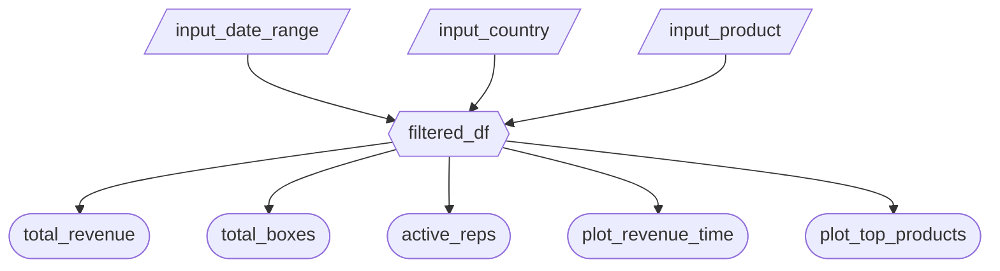

### 2.1 Updated Job Stories

| #   | Job Story                       | Status         | Notes                         |
| --- | ------------------------------- | -------------- | ----------------------------- |
| 1   | When I am reviewing monthly or quarterly sales reports, I want to see total sales and breakdowns by country and product, so I can align targets and resource allocation with actual performance. | ✅ Implemented |Filters (date range, country, product) + KPI value boxes are live |
| 2   | When I am planning product mix and promotions, I want to see which products sell best over time and by country, so I can prioritize premium lines and seasonal campaigns.| 🔄 Revised | Originally included YoY % change in value boxes; deferred to M3 due to complexity. Revenue Over Time chart added instead |
| 3   | When I am evaluating my sales team, I want to compare salespeople by revenue and boxes shipped by region, so I can recognize top performers and support those in underperforming areas. | ⏳ Pending M3  | Salesperson leaderboard table planned for M3 |

### 2.2 Component Inventory

| ID                  | Type          | Shiny widget / renderer      | Depends on                                           | Job story  |
| ------------------- | ------------- | ---------------------------- | ---------------------------------------------------- | ---------- |
| `input_date_range`  | Input         | `ui.input_date_range()`      | —                                                    | #1, #3     |
| `input_country`     | Input         | `ui.input_selectize()`       | —                                                    | #1, #2     |
| `input_product`     | Input         | `ui.input_selectize()`       | —                                                    | #1, #3     |
| `filtered_df`       | Reactive calc | `@reactive.calc`             | `input_date_range`, `input_country`, `input_product` | #1, #2, #3 |
| `total_revenue`     | Output        | `@render.text`               | `filtered_df`                                        | #1         |
| `total_boxes`       | Output        | `@render.text`               | `filtered_df`                                        | #1         |
| `active_reps`       | Output        | `@render.text`               | `filtered_df`                                        | #2         |
| `plot_revenue_time` | Output        | `@render.altair`             | `filtered_df`                                        | #3         |
| `plot_top_products` | Output        | `@render.altair`             | `filtered_df`                                        | #3         |

### 2.3 Reactivity Diagram

