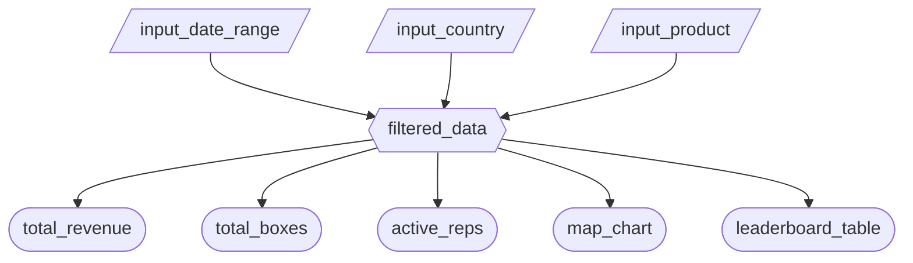

### 2.1 Updated Job Stories

| #   | Job Story                                                                                                                                                   | Status         | Notes                                                              |
| --- | ----------------------------------------------------------------------------------------------------------------------------------------------------------- | -------------- | ------------------------------------------------------------------ |
| 1   | When I open the dashboard, I want to see KPI summary cards so I can get an at-a-glance overview of total revenue, boxes shipped, and active sales reps.     | ✅ Implemented |                                                                    |
| 2   | When I apply date, country, or product filters, I want all metrics and charts to update simultaneously so I can analyze any specific segment quickly.        | ✅ Implemented |                                                                    |
| 3   | When I select a chocolate product or date range, I want to see a world map colored by country revenue so I can identify which markets are performing best.   | ✅ Implemented |                                                                    |
| 4   | When I want to evaluate team performance, I want to see a ranked leaderboard of sales reps with revenue and transaction counts so I can spot top performers. | ✅ Implemented |                                                                    |

### 2.2 Component Inventory

| ID                 | Type          | Shiny widget / renderer              | Depends on                                         | Job story  |
| ------------------ | ------------- | ------------------------------------ | -------------------------------------------------- | ---------- |
| `input_date_range` | Input         | `ui.input_date_range()`              | —                                                  | #1, #2     |
| `input_country`    | Input         | `ui.input_selectize()`               | —                                                  | #2, #3, #4 |
| `input_product`    | Input         | `ui.input_selectize()`               | —                                                  | #2, #3, #4 |
| `filtered_data`    | Reactive calc | `@reactive.calc`                     | `input_date_range`, `input_country`, `input_product` | #1–#4    |
| `total_revenue`    | Output        | `@render.text`                       | `filtered_data`                                    | #1, #2     |
| `total_boxes`      | Output        | `@render.text`                       | `filtered_data`                                    | #1, #2     |
| `active_reps`      | Output        | `@render.text`                       | `filtered_data`                                    | #1, #2     |
| `map_chart`        | Output        | `@render.ui` (Altair choropleth)     | `filtered_data`                                    | #2, #3     |
| `leaderboard_table`| Output        | `@render.data_frame`                 | `filtered_data`                                    | #2, #4     |

### 2.3 Reactivity Diagram

### 2.4 Calculation Details

**`filtered_data`** (`@reactive.calc`)

- **Depends on:** `input_date_range`, `input_country`, `input_product`
- **Transformation:** Copies the full dataset, restricts rows to the selected date window, then optionally filters to a single country and/or product when the user has not selected "All".
- **Consumed by:** `total_revenue`, `total_boxes`, `active_reps`, `map_chart`, `leaderboard_table`
