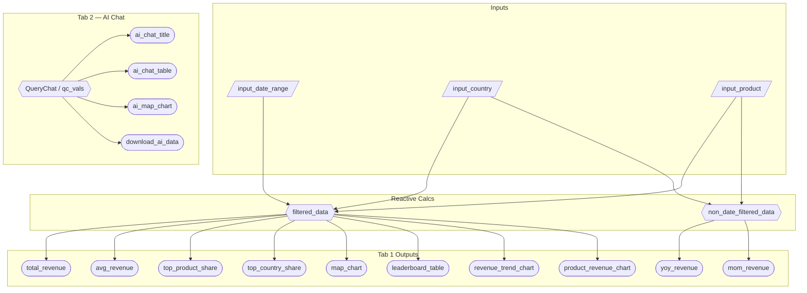

### 2.1 Updated Job Stories

| #   | Job Story                                                                                                                                                   | Status         | Notes                                                              |
| --- | ----------------------------------------------------------------------------------------------------------------------------------------------------------- | -------------- | ------------------------------------------------------------------ |
| 1   | When I open the dashboard, I want to see KPI summary cards so I can get an at-a-glance overview of total revenue, average revenue, YoY growth, MoM growth, and how concentrated revenue is in the top product and country.     | ✅ Implemented | Top Product Revenue Share and Top Country Revenue Share cards added. |
| 2   | When I apply date, country, or product filters, I want all metrics and charts to update simultaneously so I can analyze any specific segment quickly (including product-level analysis to identify best-sellers).        | ✅ Implemented | Revenue by Product pie chart added for product-level analysis.     |
| 3   | When I select a chocolate product or date range, I want to see a world map colored by country revenue so I can identify which markets are performing best.   | ✅ Implemented | The map is clickable: clicking a country toggles it in the Country filter. |
| 4   | When I want to evaluate team performance, I want to see a ranked leaderboard of sales reps with revenue, transactions, boxes, avg deal size, and revenue share so I can spot top performers. | ✅ Implemented |                                                                    |
| 5   | When I want to track sales momentum, I want to see a revenue trend line chart for the top 5 sales reps over time so I can identify trends and seasonality. | ✅ Implemented | Added in M3. Shows monthly revenue for top 5 reps by total revenue. |
| 6   | When I want to explore the data using natural language, I want an AI chat tab where I can ask questions and get filtered tables, maps, and downloadable CSVs. | ✅ Implemented | Implemented in M3: AI Chat Helper tab via QueryChat & requires `ANTHROPIC_API_KEY`. |

### 2.2 Component Inventory

#### Tab 1 — Chocolate Sales Dashboard

| ID                    | Type          | Shiny widget / renderer              | Depends on                                           | Job story  |
| --------------------- | ------------- | ------------------------------------ | ---------------------------------------------------- | ---------- |
| `input_year`          | Input         | `ui.input_radio_buttons()`           | —                                                    | #1–#5      |
| `input_date_range`    | Input         | `ui.input_date_range()`              | —                                                    | #1–#5      |
| `input_country`       | Input         | `ui.input_selectize(multiple=True)`  | —                                                    | #2–#5      |
| `input_product`       | Input         | `ui.input_selectize(multiple=True)`  | —                                                    | #2–#5      |
| `filtered_data`       | Reactive calc | `@reactive.calc`                     | `input_date_range`, `input_country`, `input_product`  | #1–#5      |
| `non_date_filtered_data` | Reactive calc | `@reactive.calc`                  | `input_country`, `input_product`                      | #1         |
| `total_revenue`       | Output        | `@render.text`                       | `filtered_data`                                      | #1, #2     |
| `avg_revenue`         | Output        | `@render.text`                       | `filtered_data`                                      | #1, #2     |
| `top_product_share`   | Output        | `@render.text`                       | `filtered_data`                                      | #1, #2     |
| `top_country_share`   | Output        | `@render.text`                       | `filtered_data`                                      | #1, #2     |
| `yoy_revenue`         | Output        | `@render.text`                       | `non_date_filtered_data`                             | #1         |
| `mom_revenue`         | Output        | `@render.text`                       | `non_date_filtered_data`                             | #1         |
| `map_chart`           | Output        | `@render.ui` (Altair choropleth; clickable)     | `filtered_data`                                      | #2, #3     |
| `leaderboard_table`   | Output        | `@render.data_frame`                 | `filtered_data`                                      | #2, #4     |
| `revenue_trend_chart` | Output        | `@render.ui` (Altair line chart)     | `filtered_data`                                      | #2, #5     |
| `product_revenue_chart` | Output      | `@render.ui` (Altair pie chart)       | `filtered_data`                                      | #2         |

#### Tab 2 — AI Chat Helper

| ID                    | Type          | Shiny widget / renderer              | Depends on                                           | Job story  |
| --------------------- | ------------- | ------------------------------------ | ---------------------------------------------------- | ---------- |
| QueryChat sidebar     | Input         | `qc.sidebar()` (querychat)           | —                                                    | #6         |
| `ai_chat_title`       | Output        | `@render.text`                       | `qc_vals.title()`                                    | #6         |
| `ai_chat_table`       | Output        | `@render.data_frame`                 | `qc_vals.df()`                                       | #6         |
| `ai_map_chart`        | Output        | `@render.ui` (Altair choropleth)     | `qc_vals.df()`                                       | #6         |
| `download_ai_data`    | Output        | `@render.download`                   | `qc_vals.df()`                                       | #6         |

### 2.3 Reactivity Diagram

```mermaid
flowchart TD
  subgraph Inputs
    A[/input_date_range/]
    B[/input_country/]
    C[/input_product/]
  end

  subgraph "Reactive Calcs"
    F{{filtered_data}}
    NDF{{non_date_filtered_data}}
  end

  A --> F
  B --> F
  C --> F
  B --> NDF
  C --> NDF

  subgraph "Tab 1 Outputs"
    R([total_revenue])
    AVG([avg_revenue])
    TPS([top_product_share])
    TCS([top_country_share])
    YOY([yoy_revenue])
    MOM([mom_revenue])
    M([map_chart])
    L([leaderboard_table])
    RT([revenue_trend_chart])
    PR([product_revenue_chart])
  end

  F --> R
  F --> AVG
  F --> TPS
  F --> TCS
  F --> M
  F --> L
  F --> RT
  F --> PR
  NDF --> YOY
  NDF --> MOM

  subgraph "Tab 2 — AI Chat"
    QC{{QueryChat / qc_vals}}
    QC --> AT([ai_chat_title])
    QC --> ATBL([ai_chat_table])
    QC --> AM([ai_map_chart])
    QC --> DL([download_ai_data])
  end
```

### 2.4 Calculation Details

**`filtered_data`** (`@reactive.calc`)

- **Depends on:** `input_date_range`, `input_country`, `input_product`
- **Transformation:** Copies the full dataset, restricts rows to the selected date window, then filters to the selected countries and/or products when any are chosen (empty selection = all).
- **Consumed by:** `total_revenue`, `avg_revenue`, `top_product_share`, `top_country_share`, `map_chart`, `leaderboard_table`, `revenue_trend_chart`, `product_revenue_chart`

**`non_date_filtered_data`** (`@reactive.calc`)

- **Depends on:** `input_country`, `input_product`
- **Transformation:** Copies the full dataset and applies country and product filters only (ignores date range). This ensures YoY and MoM comparisons always use the full time span of the data.
- **Consumed by:** `yoy_revenue`, `mom_revenue`

**`yoy_revenue`** (`@render.text`)

- **Logic:** Groups by month, compares the latest year's revenue (up to the last available month) against the same months of the prior year. Returns the percentage change with a +/− sign, or "N/A" if insufficient data.

**`mom_revenue`** (`@render.text`)

- **Logic:** Groups by month, compares the last available month's total revenue to the prior month. Returns the percentage change with a +/− sign, or "N/A" if insufficient data.

**`top_product_share`** (`@render.text`)

- **Logic:** Aggregates `filtered_data` by product (`Amount` sum), finds the product with the highest revenue, and returns its share of total revenue as a percentage (e.g., "32.5%"). Shows how concentrated sales are in the single best-selling product for the current filters.

**`top_country_share`** (`@render.text`)

- **Logic:** Aggregates `filtered_data` by country (`Amount` sum), finds the country with the highest revenue, and returns its share of total revenue as a percentage. Highlights geographic concentration and risk in the current filtered segment.

**Clickable map filtering** (`map_chart` in `map_chart.py` + server handler in `app.py`)

- **Logic:** The choropleth map embeds a small JS click handler that posts the clicked country name to the Shiny app. The server listens for `map_clicked_country()` and updates `input_country` by toggling the clicked country (add if not selected, remove if already selected). This enables direct filtering by clicking countries on the map.

**`leaderboard_table_data`** (helper function in `leaderboard.py`)

- **Logic:** Groups by sales person, computes Revenue, Transactions, Boxes, Avg Deal, and Rev Share %. Ranks by descending revenue and appends an AVERAGE / TOTAL summary row.

**`revenue_trend_chart_ui`** (helper function in `revenue_trend.py`)

- **Logic:** Identifies the top 5 sales reps by total revenue in the filtered data, aggregates their revenue by month, and renders an Altair multi-line chart with points and tooltips.

**`product_revenue_chart_ui`** (helper function in `product_revenue.py`)

- **Logic:** Aggregates filtered data by product (sum of Amount), computes share of total revenue, and renders an Altair pie chart with tooltips (revenue and share %). Supports product-level analysis and best-seller identification after applying year, country, and product filters.

### 2.5 Module Structure

The app follows a modular architecture where `app.py` is the single parent that loads data, wires reactive state, and composes panels. Each UI component lives in its own module:

| Module              | Responsibility                                              |
| ------------------- | ----------------------------------------------------------- |
| `app.py`            | Data loading, reactive calcs, server wiring, tab layout     |
| `dashboard.py`      | Composes Dashboard tab layout                               |
| `filters.py`        | Filter widget definitions                                   |
| `value_boxes.py`    | KPI value box UI                                            |
| `map_chart.py`      | Altair world choropleth map                                 |
| `leaderboard.py`    | Sales rep leaderboard table with summary row                |
| `revenue_trend.py`  | Revenue trend line chart for top 5 reps                     |
| `product_revenue.py` | Revenue by product pie chart for product-level analysis    |
| `query_chat.py`     | QueryChat AI integration and AI Chat tab layout             |
| `theme.py`          | Chocolate-themed CSS and Bootstrap Icons head content       |
| `constants.py`      | Shared constants                                            |
| `footer.py`         | Footer component with credits and GitHub link               |
